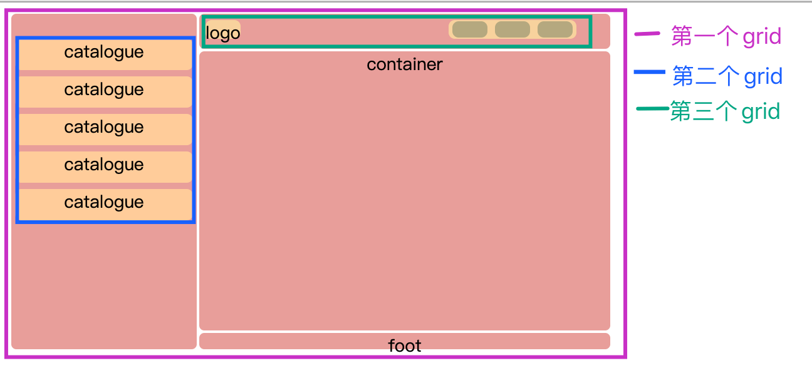

## 定义

**什么是 grid**

Grid 布局是一种二维 **栅格(网格)** 布局，常用与解决复杂页面的排版问题。
本篇文章介绍了 grid 布局常用的属性包括对容器，对项目的属性，以及与当前常见的 flex 布局方式进行了对比介绍。主要包括了 flex 与 grid 的区别，以及其分别适用于的场景。
最后是 gird 的当前兼容性情况，如有需要可以拉到屏幕最底部查看～

下面是我使用 grid 布局简单模拟的本博客 post 页面布局。


如果你想查看代码可以[点击这里 👈](https://jsbin.com/licigal/4/edit?html,css,output)

**grid 容器 子项 行线 列线**

采用 grid 布局的盒子被称为`容器（container）`，其子元素即为`子项（item）`。
而容器通过设定的参数，将盒子分为多个单元格，分割盒子的水平线即为`行线（row）`，垂直线即为`列线（column）`。
**注意：子项是容器的子元素，并不是容器分割的每一个区域都是它的子项**
下面是通过一张图片解释什么容器、子项、行线、列线的关系
如图可见，容器即为最大的**蓝色 div**，下面的三个**粉色 div**分别为容器的三个子项。容器一共有 6 个单元格，分别是由 3 条**绿色**行线和 4 条**棕色**列线组成。


## 容器常用属性

**grid-template-rows，grid-template-columns**

grid-template-rows 意为设定每条行线的间距。grid-template-columns 意为设定每条列线的间距。即前者用于设定子项的行高，后者用于设定子项的行宽


**grid-auto-flow**

用于设置子元素的排列顺序。其默认顺序为先行后列。即优先填满第一行后才会换行。

- row（default）：先行后列
- column：先列后行
- row dense：某些元素位置被固定时，剩下的元素先行后列
- column dense：某些元素位置被固定时，剩下的元素先列后行
  

**justify-items，align-items，place-items**

这里的属性是容器内子元素在单元格内的对齐方式
justify-items 和 align-items 的可选属性有

- stretch（default）：占满单元格
- start：与单元格起始位置对齐
- end：与单元格结束位置对其
- center：在单元格内居中对其

**grid-auto-columns，grid-auto-rows**

这两个属性用于设置 未设置 但却存在的网格 的宽高。

```css
.container {
  display: grid;
  grid-template-columns: 50px 50px 50px;
  grid-template-rows: 50px 50px 50px;
  grid-auto-columns: 100px;
  grid-auto-rows: 100px;
}
```

比如你只设置了 3\*3 的单元格，但却有 10 个子元素。此时。多出来的元素按照顺序排在第四行第一位。已知第一位的宽为 50px，但是高并没有在`grid-template-rows`中设置，所以会找到`grid-auto-rows`。*最后第十个子元素的宽为 50px,高为 100px*。

## 常用子项属性

**grid-column-start, grid-column-end, grid-row-start, grid-row-end**

**grid-column, grid-row**

该属性用于设定子项 所占据的单元格在哪条边线。
`grid-column-start`,`grid-column-end`,`grid-row-start`,`grid-row-end` 为四边边线的位置，`grid-column`,`grid-row`是前面四个属性的简写

```css
.item {
  grid-column-start: 2;
  grid-column-end: 4;
  /* 等同于 */
  grid-column: 2 / 4;
}
```


**justify-items，align-items，place-items 和 justify-self，align-self，place-self**

这六个属性用于设置单元格内的对其方式。和 flex 中的用法一致，只有当子项的宽高固定时才有效，故用的不多。
不同的是前三者是整体的对齐方式，应用于容器。后三者是针对于特殊子项调整对齐方式，故应用于子项。
`place-*`则是对前面对其属性的简写。

```css
/* place-*的写法 */
place-self: <align-self> <justify-self>;

.item {
  justify-self: start | end | center | stretch(default);
  align-self: start | end | center | stretch(default);
}
```

## 常用关键字

**fr 单位**

**repeat(n,t)**

接受两个参数，n：重复次数。t：需要重复的内容

```css
.container {
  display: grid;
  grid-template-columns: repeat(
    2,
    10px 20px 50px
  ); /* 等价于 grid-template-columns: 10px 20px 50px 10px 20px 50px; */
  grid-template-rows: repeat(
    3,
    100px
  ); /* 等价于grid-template-rows:100px 100px 100px; */
}
```

**minmax(min,max)**

接受两个参数，min：最小宽度。max：最大宽度

```css
.container {
  display: grid;
  grid-template-rows: 1fr minmax(50px, 1fr);
}
```

**auto-fill 与 auto-fit**

当视口宽度不固定时，用于设定自动填充单元格。

```css
.container {
  display: grid;
  grid-template-columns: repeat(auto-fit, 100px);
}
```

> `auto-fill`和`auto-fit`在此处作用相同。
> 二者的区别在于：
> `auto-fill`倾向于在现有行中容纳更多的列。而`auto-fit`倾向于使用最少列占满当前行

**关键字组合使用**

```css
.container {
  display: grid;
  grid-template-columns: repeat(auto-fit, minmax(50px, 1fr));
}
```

_这里代码的意思为这个 comtainer 列单元格 最小为 50px，最大为 1fr （minmax），且自动 (repeat) 以 尽量多(auto-fit) 的单元格填充满整个容器_

看效果可以 [👉点击这里👈](https://jsbin.com/huvoyag/8/edit?html,css,output)

**span**

该关键字意为跳过多少条 行/列 线。常用于设定子项占据单元格

```css
.item {
  grid-column: 1 / span 2; /* 其等价于 grid-column: 1 / 3; */
  grid-row: 1 / span 2; /* 其等价于 grid-row: 1 / 3; */
}
```

## 对比 flex

**flex 与 grid 的区别**

flex：简单的一维布局，当你需要在一个盒子中无需即可完成布局时，即可使用 flex
grid：二维布局。可以更好的处理复杂的业务场景

**flex 与 grid 的适用场景**

拿最初的图片举例。
第一个 grid：显然是一个二维布局。此时使用 grid 最为简洁
而第二个和第三个 gird，可以使用 grid 布局，但是使用 flex 会更为方便
总体来说在页面的整体布局时建议使用 grid。在开发单个组件的样式布局时建议使用 flex


## 兼容性

**pc web**

| chrome | opera | firefox | ie  | edge | safari |
| :----: | :---: | :-----: | :-: | :--: | :----: |
|  57+   |  44+  |   52+   | 11+ | 16+  |  10.1  |

**mobile**

| ios  | android webview | android chrome | android firefox |
| :--: | :-------------: | :------------: | :-------------: |
| 10.3 |       57+       |      57+       |       52+       |

## 参考文章

- [MDN web docs](https://developer.mozilla.org/en-US/docs/Web/CSS/CSS_Grid_Layout)
- [阮一峰大神的个人日志](https://www.ruanyifeng.com/blog/2019/03/grid-layout-tutorial.html)
