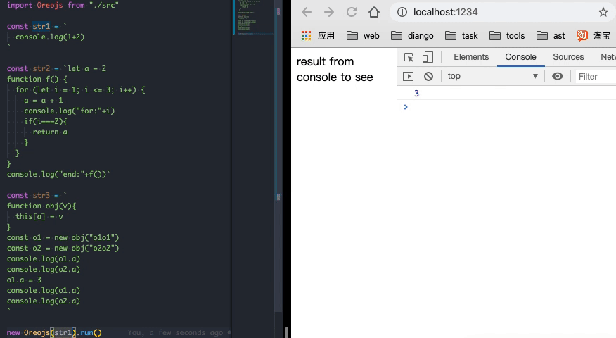

> 想看代码的直接下载项目即可，里面注释写的还算详细。
> 项目地址：[https://github.com/betterTisen/oreojs](https://github.com/betterTisen/oreojs)

## 编译原理基础

编译原理是计算机学科中一个很伟大很重要的概念：即计算机识别自然语言的一个解析过程。单独拎出来说的话也很难概括其完整的知识点，而且笔者也只是知其皮毛而已（还需努力 💪）。。。但是通俗一点概括的话，就是为什么**电脑可以将一串 js 字符串正确的让机器识别。从而得到你想要的效果**。下面我们先来看一下它的大体解析步骤是怎样的。

### 解析步骤

1. js 字符串通过词法分析和句法分析解析成一个抽象语法树（通过第三方库 acorn 实现）
2. 根据抽象语法树对不同 type 进行相应的解析（这里是本篇文章需要完成的）

### JavaScript 语法树 type 的基本认知

我推荐这一篇文章，大家可以快速预览一下，对 js ast 的常见 type 混个眼熟，不然一开始就撸代码可能会不知如何上手。。

## 准备工作

- 第三方库：acorn
- 一个语法树生成的在线预览工具：[https://astexplorer.net](https://astexplorer.net)

建议各位可以先在上面的网址中随意的写一段简单的 js 代码，然后看一看生成的语法树结构（其实就是一个 json 对象）。_主要注意每一项的 type，start 和 end 可以忽略，我们用不到_

看一下实现后的效果。然后就开始撸代码吧



## 节点遍历器（nodeIterator）

首先，通过语法树的结构可知，我们要处理的这个 json 是一个较深的树形结构。所以，我们需要一个遍历器，来一层一层的遍历节点。看下实现的代码，其中 scope 和 NodeHandler，我们会在后面的段落和大家详细介绍，现在你只需要知道，node 是语法树的 json，traverse 是根据 json 的 type 进行不同解析的方法

```javascript
class NodeIterator {
  constructor(node, scope) {
    //node，就是树，随着节点的遍历，会有不同的子树被传入
    this.node = node
    //当前的作用域
    this.scope = scope
    //对各类节点的处理
    this.nodeHandler = NodeHandler
  }

  // 用于作用域处理，后面会说
  createScope() {
    return new Scope(this.scope)
  }

  traverse(node, opt = {}) {
    //如果opt传入type，则使用传入的type，这里的意思是如果子树是一个新的作用域，则使用全新的作用域，否则，其作用域仍是当前作用域
    const scope = opt.scope ? opt.scope : this.scope
    const _evel = this.nodeHandler[node.type]
    const nodeIterator = new NodeIterator(node, scope)
    if (!_evel) {
      throw new Error(`Unknown node type "${node.type}"`)
    }
    return _evel(nodeIterator)
  }
}
```

## 作用域处理（scope）

设想一下，如果上面的节点遍历器如果没有处理作用域会怎样？那不是每一个声明的变量都会处于全局之中吗，这显然是不对的。所以，我们需要一个类来对作用域进行管理。下面的代码就是一个完整的作用域处理类，不要看它这么长，其实很简单  
看 **constructor**，这个类在初始化的时候，有三个属性，分别是自己的作用域，父级作用域，全局作用域。下面的 get 方法，即是获取变量的值，在当前作用域找，找不到就到父级找（注意，往父级查找是一个递归），最后找到全局，set 方法也一样

```javascript
class Scope {
  constructor(parentScope) {
    this.parentScope = parentScope
    this.globalDeclaration = globalMap
    this.declaration = Object.create(null) // 每次都新建一个全新的作用域
  }

  // 获取变量值
  get(name) {
    if (this.declaration[name]) {
      return this.declaration[name]
    } else if (this.parentScope) {
      return this.parentScope.get(name)
    } else if (this.globalDeclaration[name]) {
      return this.globalDeclaration[name]
    }
    throw new ReferenceError(`${name} is not defined`)
  }

  // 对已定义变量赋值
  set(name, value) {
    if (this.declaration[name]) {
      this.declaration[name].set(value)
    } else if (this.parentScope) {
      this.parentScope.set(name, value)
    } else if (this.globalDeclaration[name]) {
      return this.globalDeclaration.set(name, value)
    } else {
      throw new ReferenceError(`${name} is not defined`)
    }
  }

  // 抽象了三种变量定义方式
  declare(name, value, kind = "var") {
    if (kind === "var") {
      return this.varDeclare(name, value)
    } else if (kind === "let") {
      return this.letDeclare(name, value)
    } else if (kind === "const") {
      return this.constDeclare(name, value)
    } else {
      throw new Error(`OreoJs: Invalid Variable Declaration Kind of "${kind}"`)
    }
  }

  varDeclare(name, value) {
    // 由于var类型有着变量提升的特性。在这里我直接使用let的方式来解析var，顾这里的var并没有做变量提升
    this.letDeclare(name, value)
  }

  letDeclare(name, value) {
    // 不允许重复定义
    if (this.declaration[name]) {
      throw new SyntaxError(`Identifier ${name} has already been declared`)
    }
    this.declaration[name] = new SimpleValue(name, value, "let")
    return this.declaration[name]
  }

  constDeclare(name, value) {
    // 不允许重复定义
    if (this.declaration[name]) {
      throw new SyntaxError(`Identifier ${name} has already been declared`)
    }
    this.declaration[name] = new SimpleValue(name, value, "const")
    return this.declaration[name]
  }
}
```

上面的代码中有一个 SimpleValue，和 一个 globalMap。

- SimpleValue：定义变量值，主要用于处理常量
- globalMap：注入全局变量

没啥好说的，直接贴代码

```javascript
// SimpleValue.js
class SimpleValue {
  constructor(name, value, kind = "") {
    this.name = name
    this.value = value
    this.kind = kind
  }

  set(value) {
    // 禁止重新对const类型变量赋值
    if (this.kind === "const") {
      throw new Error(`"${this.name}" is read-only`)
    } else {
      this.value = value
    }
  }

  get() {
    return this.value
  }
}
// globalMap.js
import SimpleValue from "../util/simpleValue"

const globalMap = {
  window: new SimpleValue("window", window),
  console: new SimpleValue("console", console),
  Date: new SimpleValue("Date", Date),
}
```

## 各类节点处理（nodeHandler）

当作用域的问题解决之后，接下来就是一个繁复的工作了：对不同 type 的 tree 进行解析。这里的 nodeHandler 就是我们上面说的对各类节点的处理

**根节点处理器 Program**

根节点是一个数组，所以只需要对数组进行循环解释即可

```javascript
Program(nodeIterator) {
  for (const e of nodeIterator.node.body) {
    nodeIterator.traverse(e)
  }
}
```

**变量定义节点处理器 VariableDeclaration**

这里基本就是根据定义变量的数量以及类型，循环进行赋值

```javascript
VariableDeclaration(nodeIterator) {
  const { kind } = nodeIterator.node
  const variableNodes = nodeIterator.node.declarations
  for (const variableNode of variableNodes) {
    const k = variableNode.id.name
    const v = variableNode.init ? nodeIterator.traverse(variableNode.init) : undefined
    nodeIterator.scope.declare(k, v, kind)
  }
}
```

**标识符节点处理器 Identifier**

注意，这里的方法只用于读取值

```javascript
// 标识符(用于读取值)
Identifier(nodeIterator) {
  const { name } = nodeIterator.node

  if (name === "undefined") {
    return undefined
  }

  return nodeIterator.scope.get(nodeIterator.node.name).value
}
```

**字符节点处理器 Literal**

字面量直接返回就好

```javascript
//字面量
Literal(nodeIterator) {
    return nodeIterator.node.value
}
```

**表达式调用节点处理器 CallExpression**

函数调用，这里注意最后return的结果需要让this指向func

```javascript
// 函数调用表达式，即表示了 func(1, 2) 这一类型的语句
CallExpression(nodeIterator) {
  const func = nodeIterator.traverse(nodeIterator.node.callee)
  const args = nodeIterator.node.arguments.map((arg) => nodeIterator.traverse(arg))
  let value
  if (nodeIterator.node.callee.type === "MemberExpression") {
    value = nodeIterator.traverse(nodeIterator.node.callee.object)
  }
  return func.apply(value, args)
}
```

**表达式节点处理器 MemberExpression**

```javascript
// 成员表达式节点，即表示引用对象成员的语句
MemberExpression(nodeIterator) {
  const obj = nodeIterator.traverse(nodeIterator.node.object)
  const { name } = nodeIterator.node.property
  return obj[name]
}
```

其他的节点处理方式可以通过顶部的地址去看～这里知识列出了常见的节点处理方式，只要逐步完善这里的方法，让这个对象对各类节点都支持解析，就完成了一个基本的解释器

## 总结

总结一下，写这个解释器最复杂的就是处理作用域的问题，理解了这个解析器递归解释树的思路后，就是去写NodeIterator中不同type所对应的方法就行啦，看完这边文章后还不了解的话可以把github的代码拉下来，通过整个项目去看更容易理解一些，毕竟文章篇幅有限。

## 参考资料

[前端与编译原理——用 JS 写一个 JS 解释器](https://segmentfault.com/a/1190000017241258#item-6-2)

[jrainlau/canjs](https://github.com/jrainlau/canjs)
