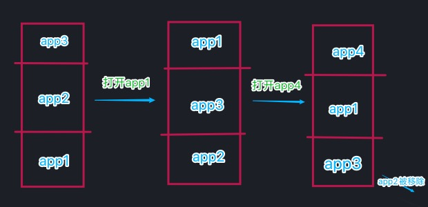

## 什么是 LRU 算法

LRU 全称 **Least Resource Used**，翻译过来即是 最后被使用的资源。也就是说，最后被使用的资源是有用的，很久没有使用过的资源是无用的，内存满了之后 LRU 就会优先销毁 很久没有使用的资源。

🌰 拿安卓手机举例，把运行后台想像成一个存储空间，假设手机最多只能在后台运行 3 个程序，当你按顺序打开 app1、app2、app3 时，在空间中的存储顺序按 LRU 的排序方式为 app3、app2、app1，此时再次打开 app1、顺序变为 app1、app3、app2，最后再打开 app4，由于后台最多只能运行 3 个程序，app2 为最久未打开的程序，所以 app2 被移除，app4 进入后台，如图所示：



## LRU 算法的描述

根据上面的例子，设想一下如果我们需要实现一个类来模拟 LRU 的缓存方式，首先，我们需要一个用户定义的常量 SIZE，用于告知其最大缓存数是多少。其次，需要一个 get 和 put methods，用于获取其保存的内容和插入新的内容。

## LRU 实现

这里选择用 map 来实现 LRU，因为 map 的键值插入是有序的,而 object 插入是无序的，无法找到最先插入的数据

```javascript
class LRUCache {
  constructor(size) {
    this.size = size
    this.map = new Map()
  }

  get(key) {
    let val = this.map.get(key)
    if (typeof val === "undefined") {
      return undefined
    }
    // 重新向map注入
    this.map.delete(key)
    this.map.set(key, val)
    return val
  }

  put(key, value) {
    // 如果key存在，del key
    if (this.map.has(key)) {
      this.map.delete(key)
    }

    this.map.set(key, value)
    let keys = this.map.keys()
    // 长度超出时 清楚第一项
    if (this.map.size > this.size) {
      this.map.delete(keys.next().value)
    }
  }
}
```
