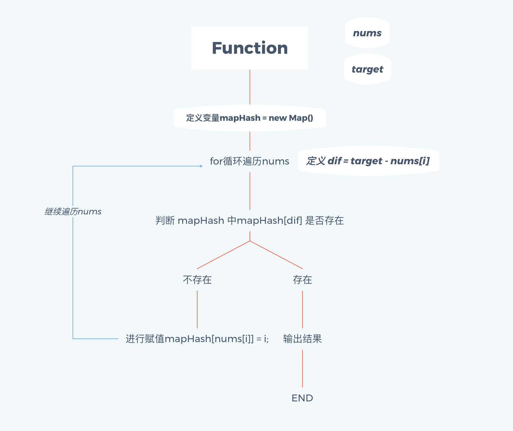

hello~ 本周，我们正式开始 **每周算法** 这个专题了，我会尽自己的努力，在自己学习算法的道路上，把自己做过的题目和解题思路 分享给大家，希望大家能和我一起进步、成长。

因为本周是第一篇文章，所以我会给出一道题目以及该题的解题过程。并且在结尾给出下周的题目，留给大家时间思考、练习，然后在下周给出本周题目的解答过程～

## 每周算法：两数之和

话不多说，直接进入主题，本周我们来学习leetcode上的第一题，关于**两数之和**的问题，题目如下：

给定一个整数数组 nums 和一个目标值 target，请你在该数组中找出和为目标值的那 两个 整数，并返回他们的数组下标。

**你可以假设每种输入只会对应一个答案。但是，数组中同一个元素不能使用两遍。**

```javascript
//举个🌰
nums = [2, 7, 11, 15]
target = 9
因为 nums[0] + nums[1] = 2 + 7 = 9
所以 return [0, 1]
```

## 解答过程

这里我会用2种解法由浅入深的给大家完成这道题目

### 直接遍历

```javascript
var twoSum = function(nums, target) {
	for (var i = 0; i < nums.length; i++) {
		var dif = target - nums[i];
		// 因为题目说 同一个元素不能使用两遍
		// 故从i+1开始遍历
		for (var j=i+1; j<nums.length; j++){
			if(nums[j] == dif) return [i,j];
		}
	}
	return false
};
```

甭管什么花里胡哨的，老夫写算法就没有for循环解决不了的，如果不行，就再套一层for循环！奥力给！造它就完了！


直接遍历的方法是最容易想到的，所以代码就不进行解释了。但是此方法的时间复杂度是O(n^2)，所以执行效率非常差，虽然我上面说 **没有for循环解决不了的问题** ，但是在实际面试过程当中，面试题出现算法类型的问题时，面试官是不希望看到这种解法的，如果在面试过程中使用多重for循环嵌套，实际上是一个减分项...

所以，请看第二种解法：

### Map 遍历

废话不多说，先上代码：

```javascript
var twoSum = function(nums, target) {
  var mapHash = new Map()
  for(var i=0;i<nums.length;i++){
    var dif = target - nums[i];
    if(mapHash.get(dif) != undefined){
      return [mapHash.get(dif),i];
		}
		mapHash.set(nums[i],i)
	}
};
```

我在leetcode上做了编译测试，执行效率比之前的快了将近一倍，由于其只有一层for循环，故时间复杂度为O(n)，大致思路是这样的：



注意看图例的**mapHash[ nums[i] ]=i** 与上面的 **mapHash[ dif ]**

**实际上就是判断了 两数之差dif 是否 存在于mapHash的集合中**，

mapHash是什么？**它就是用于存储每一项所对应的key**，这样，在for循环当中，只需要每次查找这个集合当中是否有能够匹配当前数据的key即可～

## 下周题目

既然这周完成了两数之和的题目，我想...下周要不来个三数之和吧～

嗯就这样！！


该题出自 leetcode 15题，题目如下：

给你一个包含 n 个整数的数组 nums，判断 nums 中是否存在三个元素 a，b，c ，使得 a + b + c = 0 ？请你找出所有满足条件且不重复的三元组。

**注意：答案中不可以包含重复的三元组。**

```javascript
//举个🌰
给定数组 nums = [-1, 0, 1, 2, -1, -4]，

满足要求的三元组集合为：
[
  [-1, 0, 1],
  [-1, -1, 2]
]
```

这里给个小提示，三数之和的解法其实与链表的知识点相关，你想到怎么做了嘛～

我会在下周给大家解答，⛽️⛽️⛽️