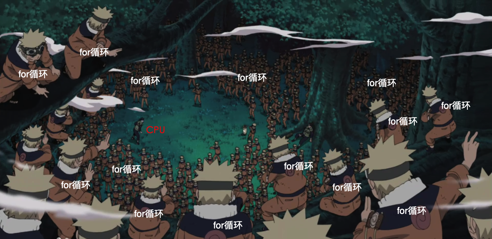
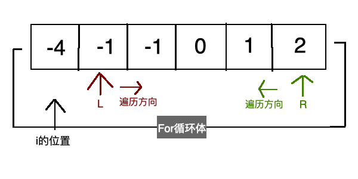

咱们书接上回，本篇文章来解答 三数之和 的问题，同时，这是一道 **双指针遍历/滑动窗口** 的例题，故咱们现在开启本类型题目的算法篇，接下来的几周内，我都会在leetcode上找一道同类型的题目给大家去做，让各位同学把算法和数据结构结合在一起，提高自身的编程基础，从而写出更优雅的代码，亦或更好的应对面试。

相信大家在跟着我学习完所有类型的算法题目后，一定可以应对绝大多数公司面试的算法题，做到信手拈来一顿乱秀！

## 【每周算法】（双指针遍历篇）：三数之和

这里我把上期的题目在这里再发一遍，方便大家对照着答案来看：

给你一个包含 n 个整数的数组 nums，判断 nums 中是否存在三个元素 a，b，c ，使得 a + b + c = 0 ？请你找出所有满足条件且不重复的三元组。

**注意：答案中不可以包含重复的三元组。**

```javascript
//举个🌰
给定数组 nums = [-1, 0, 1, 2, -1, -4]，

满足要求的三元组集合为：
[
  [-1, 0, 1],
  [-1, -1, 2]
]
```

## 解答过程

由于本提中给出的数组是未排序，且有重复数据的情况，所以首先需要做排序和去重处理

### 先来看最容易想到的 多重  for 循环：



```javascript
var threeSum = function(nums) {
	let res = []
	// 如果数组小于3时没有遍历的意义，故return
	if(nums == null || nums.length < 3) return res;
	nums.sort((a, b) => a-b) // 排序
	for (let i = 0; i < nums.length - 2; i++) {
		// 因为数组已经排序，所以当i>0时就没有遍历下去的意义了
		if(nums[i] > 0) break;
		// 去重处理
		if(i > 0 && nums[i] == nums[i-1]) continue
		for (let j = i + 1; j < nums.length - 1; j++) {
			for (let k = j + 1; k < nums.length; k++) {
				if (nums[i] + nums[j] + nums[k] === 0)
					res.push([nums[i], nums[j], nums[k]])
			}
		}
	}
	return res
}
```

- 编译超时

过高的时间复杂度导致代码编译效率极差，所以leetcode不给予通过。这种方法是在面试中实在想不出其他解法时的选择.....

### Hash解法

回忆一下我们上一篇文章（两数之和问题）里的Hash解法，把两层for循环变成了一层，提高了代码的运行效率。

那么我们是否能在这里使用我们上一篇文章中的方法来优化上面的三层for循环呢？


答案当然是可以的，现学现卖，直接上代码

```javascript
var threeSum = function(nums) {
	let arr = []
	if(nums == null || nums.length < 3) return arr;
	nums.sort((a, b) => a - b)
	for(var i =0; i<nums.length-2; i++){
		const hashMap = new Map()
		if(nums[i] > 0) break;
		// 去重处理
		if(i > 0 && nums[i] == nums[i-1]) continue
		for(var j =i+1; j<nums.length; j++){
			const dif = -(nums[i]+nums[j])
			// 去重处理
			// 因为hashMap是首次记录第二次才会push到数组，所以需要判断只有三次重复才能continue
			if(j>i+2 && nums[j]==nums[j-1] && nums[j]==nums[j-2])
				continue
			if(hashMap.has(dif)){
				arr.push([nums[i],nums[hashMap.get(dif)],nums[j]])
				hashMap.delete(dif)
			}
			hashMap.set(nums[j],j)
		}
	}
	return arr
};
```

- 执行用时 :444 ms, 在所有 JavaScript 提交中击败了 6.25% 的用户
- 内存消耗 :46.1 MB, 在所有 JavaScript 提交中击败了 100.00% 的用户

显然，前一种解法编译超时，该解法在leetcode上已经可以达到勉强通过了，并且使用到了上一篇文章中的知识点，怎么样，是不是有些许的成就感呢？

**本解法的思路和前一题的两数之和hash解法类似，为什么可以把时间复杂度由O(n^3)变为O(n^2)呢？因为hashMap存储了一次遍历数据，这样在第二层遍历中，就可以从hashMap获取数据与前面的2次循环数据进行查找匹配了。**

### 双指针遍历法

上面用了之前学过的知识优化了这道题，但是，这依然不是最优解法，这里就到我们本篇文章的重点了：双指针遍历，考虑到各位可能不明白什么是双指针遍历，我会用一张图来演示。

还是老习惯，先上代码，结合着代码看图会非常清楚：

```javascript
var threeSum = function(nums) {
	let res = [];
	if(nums == null || nums.length < 3) return res;
	nums.sort((a, b) => a - b); // 排序
	for (let i = 0; i < nums.length-2 ; i++) {
		if(nums[i] > 0) break; 
		if(i > 0 && nums[i] == nums[i-1]) continue; // 去重
		let L = i+1;
		let R = nums.length-1;
		while(L < R){
			const sum = nums[i] + nums[L] + nums[R];
			if(sum == 0){
				res.push([nums[i],nums[L],nums[R]]);
				while (L<R && nums[L] == nums[L+1]) L++; // 去重
				while (L<R && nums[R] == nums[R-1]) R--; // 去重
				L++;
				R--;
			}
			else if (sum < 0) L++;
			else if (sum > 0) R--;
		}
	}        
	return res;
};
```

- 执行用时 :144 ms, 在所有 JavaScript 提交中击败了 98.17%的用户
- 内存消耗 :45.6 MB, 在所有 JavaScript 提交中击败了100.00%的用户

讲解一下这段代码：上面的nums排序和去重就不说了，进入第一层for循环，定义了变量L和R，看作是2个指针（故此解法为双指针遍历法）此时的遍历状态如图所示



看到这张概念图后，是不是已经有内味了？随后进入第二层循环（while）进行判断：

- 如果 nums[i] + nums[L] + nums[R] >0, 说明三数之和大于0， L向右移一位使三数之和变大
- 如果 nums[i] + nums[L] + nums[R] <0, 说明三数之和小于0， R向左移一位使三数之和变小
- 如果 nums[i] + nums[L] + nums[R] =0, 说明三数之和等于0，此时就是我们需要的答案，所以将这三个数push到res当中
- 如果 L>=R，则证明双指针遍历完成，跳出while循环，进入第二层for循环

好了，本题讲解到此结束，同时，本周也进入了双指针算法篇的学习，往后的几周，我都会在leetcode上筛选出一些同类型的题目，来巩固该应对类型题目的解题能力。


## 下周题目

本篇文章题目为三数之和问题，那么下周我们就来解决这道 **最接近的三数之和** 问题，该题为leetcode第16题，依然是一道 双指针算法题，各位想想看怎么做吧？题目如下：

给定一个包括 n 个整数的数组 nums 和 一个目标值 target。找出 nums 中的三个整数，使得它们的和与 target 最接近。返回这三个数的和。

**注意：假定每组输入只存在唯一答案。**

```JavaScript
// 举个🌰
// 输入：nums = [-1,2,1,-4], target = 1
// 输出：2
// 解释：与 target 最接近的和是 2 (-1 + 2 + 1 = 2) 。
var threeSumClosest = function(nums, target) {
	// ...
};
```
