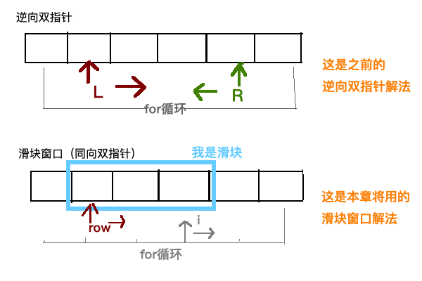

本周是 双指针遍历篇 的第四题，注意：这道题目和我们之前的做法不大一样，之前的题目是逆向的双指针解法，而这道题目：是同向的双指针解法，又名**滑块窗口法**。那这两者有什么区别呢？大家请看图：



这里先来解释一下上面的图。

- 逆向双指针：由图可知，
- 滑块窗口：

## 【每周算法】(双指针遍历篇)：长度最小的子数组

**给定一个含有 n 个正整数的数组和一个正整数 s ，找出该数组中满足其和 ≥ s 的长度最小的连续子数组，并返回其长度。如果不存在符合条件的连续子数组，返回 0。**

```JavaScript
// 举个🌰
输入: s = 7, nums = [2,3,1,2,4,3]
输出: 2
解释: 子数组 [4,3] 是该条件下的长度最小的连续子数组。
var minSubArrayLen = function (s, nums) {
	// ...
};
```

进阶: 如果你已经完成了O(n) 时间复杂度的解法, 请尝试 O(n log n) 时间复杂度的解法。

## 解答过程

### 维护数组 的滑块遍历

### 维护下标 的滑块遍历

### 维护下标优化：加入map hash

## 下周题目

下周我们继续做一道滑块遍历的题目，来巩固一下本节所学的知识。希望大家也能用今天学到的三种方法来解答出该题：

