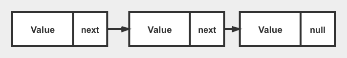
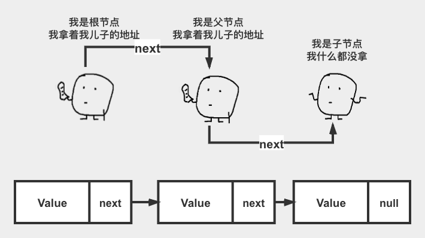
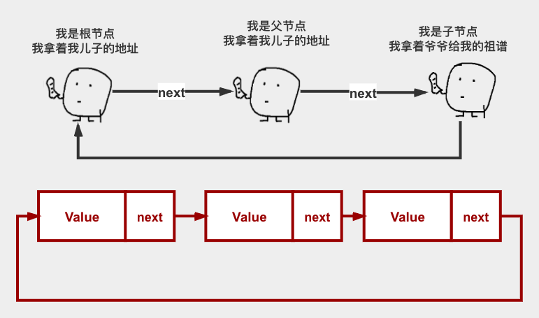
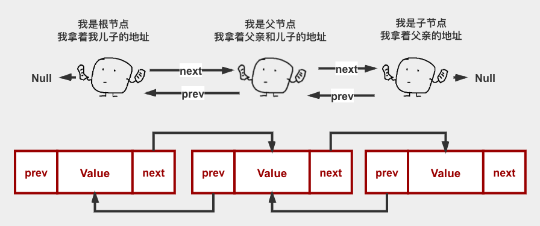

>本文仅为让大家对链表有一个基本具象的认识，为我们后面算法学习进入链表的篇章做一个铺垫、因为链表题型是面试算法题中的半壁江山、嘿嘿逃不掉的

## 链表基础定义

链表是一种常见的数据结构，在地址中存储的方式和数组不同，数组是连续的内存地址、而链表则是在每一个节点中记录了下一个节点的内存地址，常见的单链表如下图所示：



其中，Value是单个节点的值，每一个节点又有一个next ，这个属性用于找到该节点的子节点的内存地址，访问者可通过该方法访问子节点

## 图解链表

接下来我们看看常见的链表结构有哪些？

### 单链表



```javascript
const ListNode = {
	// 一级节点
	value:1,
	next:{
		// 二级节点
		value:2,
		next:{
			// 三级节点
			value:3,
			next:null
		}
	}
}
```

### 环链表



```javascript
const ListNode = {
	// 一级节点
	value:1,
	next:{
		// 二级节点
		value:2,
		next:{
			// 三级节点
			value:3,
			next:ListNode
		}
	}
}
```

### 双向链表

 

```javascript
const ListNode = {
	// 一级节点
	value:1,
	prev:null,
	next:{
		// 二级节点
		value:2,
		prev: ListNode,
		next:{
			// 三级节点
			value:3,
			prev: ListNode.next,
			next:ListNode
		}
	}
}
```
