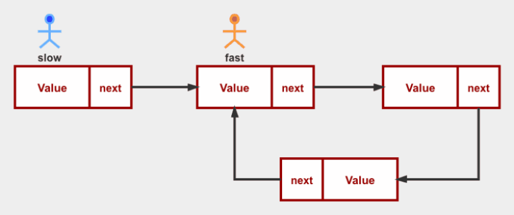

本周是双指针遍历篇的第三种（也是最后一种解题方法），快慢指针！

什么是快慢指针呢？能解决什么样得到问题呢？

假设在一个环形跑道上，小明和小红比赛跑步，假定小红的速度始终比小明快，那么小红早晚会超过小明一圈并在此相遇。



又或者，小红的速度是小明的2倍，他俩在直线跑道上跑，那当小红跑道重点时，小明正好在跑道中间

快慢指针，顾名思义，定义两个指针一快一慢，如果链表有环，则快慢两指针早晚会相遇，这样就能判断出链表中有环存在。如果链表无环，则快指针遍历完链表时，慢指针正好在链表的中间。

*所以，综上可知，快慢指针在处理链表、数组的追击问题时可以发挥出它的威力！*

## 【每周算法】(双指针遍历篇)：环形链表

>leetcode 141 题：环形链表
>https://leetcode-cn.com/problems/linked-list-cycle/

给定一个链表，判断链表中是否有环。

```JavaScript
输入： 1 => 2 => 3 => 4 => 2
输出： true

输入：1 => 2 => 3 => 4
输出：false

/**
 * @param {ListNode} head
 * @return {boolean}
 */
var hasCycle = function(head) {};
```

## 解答过程

### 节点标记法

最先想到的基础方法，不需要任何前置知识：

我们只需要遍历这个链表，在遍历过的时候给节点打一个tag，这样，如果遍历到循环结束，那该链表自然不是环形链表。

反之，如果我们遍历的时候遇到了tag，则说明我们之前也遇到过它，所以我们已经进入了环中！故`return true`

```javascript
var hasCycle = function(head) {
    // 链表长度小于2时直接return
    if(!head || !head.next) return false
    while(head) {
        if(head.tag) return true
        head.tag = true
        head = head.next
    }
    return false
};
```

- 执行用时：96 ms, 在所有 JavaScript 提交中击败了18.67%的用户
- 内存消耗：38.3 MB, 在所有 JavaScript 提交中击败了33.33%的用户

### hashMap法

百用不厌的hash法（所以说Map真是个好东西💪）。在遍历链表时存储遍历过的节点，如果Map中该节点存在，则说明链表中有环

这种解法和上面的异曲同工。

```javascript
var hasCycle = (head) => {
    if(!head || !head.next) return false
    let map = new Map()
    while (head) {
        if (map.has(head)) return true
        map.set(head, true)
        head = head.next
    }
    return false
}
```

- 执行用时：80 ms, 在所有 JavaScript 提交中击败了71.12%的用户
- 内存消耗：38.6 MB, 在所有 JavaScript 提交中击败了8.33%的用户

### 快慢指针

重点来了！别说话，看图：


```javascript
var hasCycle = function(head) {
    if(!head || !head.next) return false
    let slow = head
    let fast = head.next
    while(slow != fast){
        if(!fast || !fast.next) return false
        fast = fast.next.next
        slow = slow.next
    }
    return true
};
```

- 执行用时：76 ms, 在所有 JavaScript 提交中击败了85.77%的用户
- 内存消耗：38.3 MB, 在所有 JavaScript 提交中击败了33.33%的用户

## 最后

这是双指针遍历篇的最后一篇文章了，至此这种解题方法的三种常见题型我们也都做过啦。后面我会对前面的文章中的对撞指针、滑块指针、快慢指针的题型做一篇总结，再复习一次，同时综合的再讲解一遍。

另外，自己在公众号的创作也有一个月了，最近在思考每周算法的写作模式是否有些枯燥，应该会做一次创作模式的有趣改变，但是依旧会保持每周至少一篇的算法内容输出，和大家共同学习前端的方方面面、拭目以待吧！
