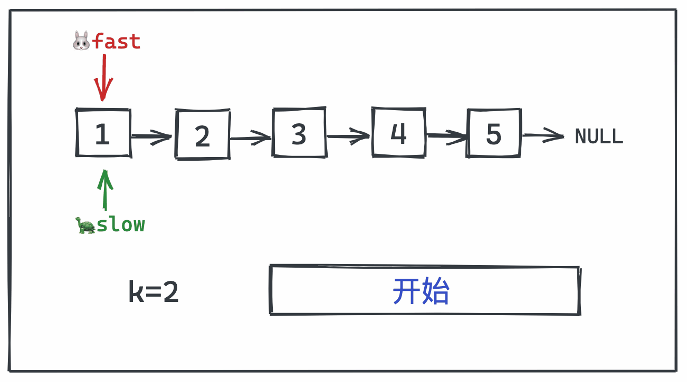

本周是链表篇的第二题，同样也是一道经典的题目。该题虽名为旋转链表，其实我觉得理解成平移链表会更好些～

废话不多说，直接看题目：

## 【动图算法】(链表篇)：旋转链表

> leetcode 61 题：旋转链表  
> https://leetcode-cn.com/problems/rotate-list/

给定一个链表，旋转链表，将链表每个节点向右移动 k 个位置，其中 k 是非负数。

```JavaScript
🌰
输入: 1->2->3->4->5->NULL, k = 2
输出: 4->5->1->2->3->NULL
解释:
向右旋转 1 步: 5->1->2->3->4->NULL
向右旋转 2 步: 4->5->1->2->3->NULL

🌰🌰
输入: 0->1->2->NULL, k = 4
输出: 2->0->1->NULL
解释:
向右旋转 1 步: 2->0->1->NULL
向右旋转 2 步: 1->2->0->NULL
向右旋转 3 步: 0->1->2->NULL
向右旋转 4 步: 2->0->1->NULL

/**
 * @param {ListNode} head
 * @param {number} k
 * @return {ListNode}
 */
var rotateRight = function(head, k) {};
```

## 解答过程

**该题解法超多，难度也不是很大，建议大家先自己写一写，然后再看解题过程。如果不思考直接看解题思路的话，学习算法的效率会大打折扣**

### 穷举法 💪

算法题目万万千，一招穷举吃遍天。。。

这种解法没什么好说的，就是按照正常思维逻辑，一步步来。

```JavaScript
const rotateRight = (head, k) => {
    if (!head || !head.next) return head
    let curr = head, n = 0
    // 遍历链表计算其长度
    while (++n && curr.next) curr = curr.next
    k = k % n	// 去重
    // 链表右移
    while (k--) {
        curr = head
        while (curr.next.next) curr = curr.next
        // 这里curr是链表的打断位置，即倒数第二项
        curr.next.next = head // 链表最后一项指向头部形成环
        head = curr.next // 定位新的头节点
        curr.next = null // 打断链表环
    }
    return head
}
```

- 遍历链表，获取链表长度 `n`
- 对 `k` 取余进行去重
- 循环 `k` 次，每次把最后一项移动到第一项

### 哈希法 🪓

算法题目万万千，哈希算法一招鲜。。。

- 在例子1中：k=2 ，head为 `1->2->3->4->5->NULL`
- 链表第一步变成: `5->1->2->3->4->NULL`
- 第二步变成: `4->5->1->2->3->NULL`
- 那我们是否可以直接简化其步骤：直接拆分倒数k项，再插入到head呢？

当然是可以的，此时，步骤就变为：

- 原链表：`1->2->3->4->5->NULL`
- 拆分后k项，链表变为：`1->2->3->NULL` 和 `4->5->NULL`
- 再合并：`4->5->1->2->3->NULL`

```JavaScript
const rotateRight = (head, k) => {
    if (!head || !head.next) return head
    let curr = head, n = 0
    let hash = new Map()
    // 遍历并将数据存入map
    while (curr && ++n) {
        hash.set(n, curr)
        curr = curr.next
    }
    k = k % n // 去重
    // 通过查找map对链表进行操作
    hash.get(n).next = head // 链表最后一项指向头部形成环
    head = hash.get(n - k).next // 定位新的头节点
    hash.get(n - k).next = null // 打断链表环
    return head
}
```

- 通过Map数据存储的特性，把第一次遍历的数据存储在Map中
- 而后直接通过 `n-k` 获取到链表右移的前一项

该解法与穷举法思路类似，唯一的不同就是在第一次遍历链表时将每一项的数据存入了Map当中，省去了一次循环。

### 快慢指针➡️➡️

>快慢指针的题型我在之前已经写过啦，所以这里就不赘述其思想，不懂得同学可以看下我之前的[文章](https://mp.weixin.qq.com/s?__biz=MzI5NTc0NzM5Ng==&mid=2247484714&idx=1&sn=e616a47a44d6d261a5d2aa32638e5d8f&chksm=ec4faf01db3826176ad2b348109b11137e59cdc12145a7504eb973693cdda1767118e6298eaa&token=182116423&lang=zh_CN#rd)

哈希法用了一个Map对遍历数据进行了存储，那么如果不存呢？我们可以直接通过快慢指针拿到需要拆除的第n-k项即可。

该解法的优点在于不用先遍历一次链表，但也因此失去了去重的功能。

**如果 k<链表长度 时，该解法性能较好，如果 k>链表长度 时，该解法性能较差**



```JavaScript
var rotateRight = function (head, k) {
    let fast = head, slow = head
    // fast 先走k步
    while (k--) {
        if (fast && fast.next) fast = fast.next
        else fast = head
    }
    // slow == fast说明k会被链表长度整除，故无需操作head直接返回即可
    if (slow === fast) return head
    // 快慢指针start
    while (fast.next) {
        slow = slow.next
        fast = fast.next
    }
    // 对慢指针位置进行打断
    fast.next = head
    head = slow.next
    slow.next = null
    return head
};
```

- 此处定义了fast和slow两个指针，fast先走k步
- 当slow == fast 时,说明k会被链表长度整除，直接返回head即可
- 快慢指针同时移动，当快指针到达链表最后一项时，慢指针正好在链表需要打断的位置

### 链表转环 ♻️

在哈希法中，我们最后处理链表时，把单链表转成了环

那么，我们当然也可以直接把链表转成环，然后在环中找到k的位置将其打断～


```JavaScript
const rotateRight = (head, k) => {
    if (!head) return null
    let curr = head, n = 0
    while (++n && curr.next) curr = curr.next
    // 形成环链表
    curr.next = head
    k = k % n // 去重
    while (++k < n) head = head.next // 找到打断位置
    // 对环链表打断再拼接得到答案
    let tmp = head
    head = head.next
    tmp.next = null
    return head
}
```

- 遍历链表，获得链表长度n
- `curr.next = head` 形成环链表
- 去重
- 通过循环`n-k>0`找到打断环的位置并打断

## 最后 🔚

这次的题目有四种解法，看似很多，实际上也就是解题思路一步步优化而得来的。所以遇到题目时无需一开始就去思考最优解，可以先尝试使用基础方法，当用基础的方式解出答案时，也会对该题目的理解更为深刻，从而发散思维，想到一些优化方案🍉～～