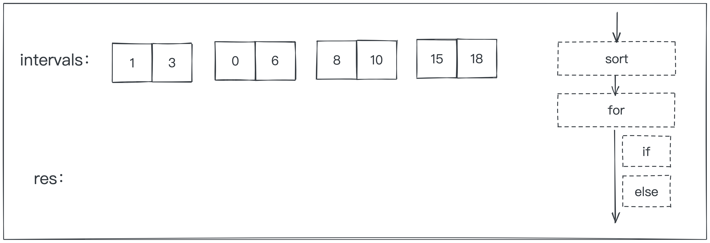
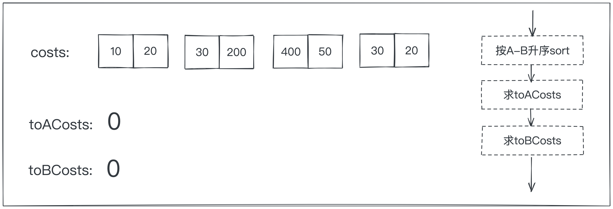

本周我们学习的是区间调度与区间合并的两道典型问题，该类问题虽然题目形式不多，但是也是经常考察的问题对象哦！这里就拿出两道最典型的题目来作为本周学习的内容吧～


## 【动图算法】：区间合并

> leetcode 56 题：合并区间  
> https://leetcode-cn.com/problems/merge-intervals/

```javascript
🌰
输入: intervals = [[1,3],[2,6],[8,10],[15,18]]
输出: [[1,6],[8,10],[15,18]]
解释: 区间 [1,3] 和 [2,6] 重叠, 将它们合并为 [1,6].
🌰🌰
输入: intervals = [[1,4],[4,5]]
输出: [[1,5]]
解释: 区间 [1,4] 和 [4,5] 可被视为重叠区间。
```

**提示：:`intervals[i][0] <= intervals[i][1]`**

## 解答过程



```javascript
var merge = function (intervals) {
    // 特殊情况判断
    if (!intervals || !intervals.length) return [];
    // 按照左项值升序排序
    intervals.sort((a, b) => a[0] - b[0]);
    let res = [intervals[0]];
    // 循环合并区间
    for (let i = 1; i < intervals.length; i++) {
        if (res[res.length - 1][1] >= intervals[i][0]) res[res.length - 1][1] = Math.max(res[res.length - 1][1], intervals[i][1]) 
        else res.push(intervals[i])
    }
    return res;
};
```


## 【动图算法】：区间调度

> leetcode 1029 题：两地调度  
> https://leetcode-cn.com/problems/two-city-scheduling/

公司计划面试 2N 人。第 i 人飞往 A 市的费用为 costs[i]\[0\]，飞往 B 市的费用为 costs[i]\[1\]。返回将每个人都飞到某座城市的最低费用，要求每个城市都有 N 人抵达。

```javascript
输入：[[10,20],[30,200],[400,50],[30,20]]
输出：110
解释：
第一个人去 A 市，费用为 10。
第二个人去 A 市，费用为 30。
第三个人去 B 市，费用为 50。
第四个人去 B 市，费用为 20。

最低总费用为 10 + 30 + 50 + 20 = 110，每个城市都有一半的人在面试。
```

## 解答过程



```javascript
var twoCitySchedCost = function (costs) {
    // 按照去A相较于去B代价最小的方式排序，即price_A - price_B
    costs.sort((a, b) => (a[0] - a[1]) - (b[0] - b[1]))
    // 切割costs数组，求前一半数组去A市的花费
    const toACosts = 
        costs.splice(0, costs.length / 2).reduce((pre, next) => pre + next[0], 0)
    // 求sortCost剩下的后一半数组去B市的花费
    const toBCosts = 
        costs.reduce((pre, next) => pre + next[1], 0)
    return toACosts + toBCosts
};
```


