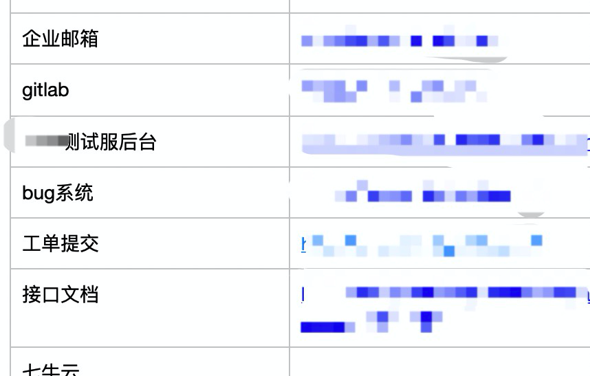
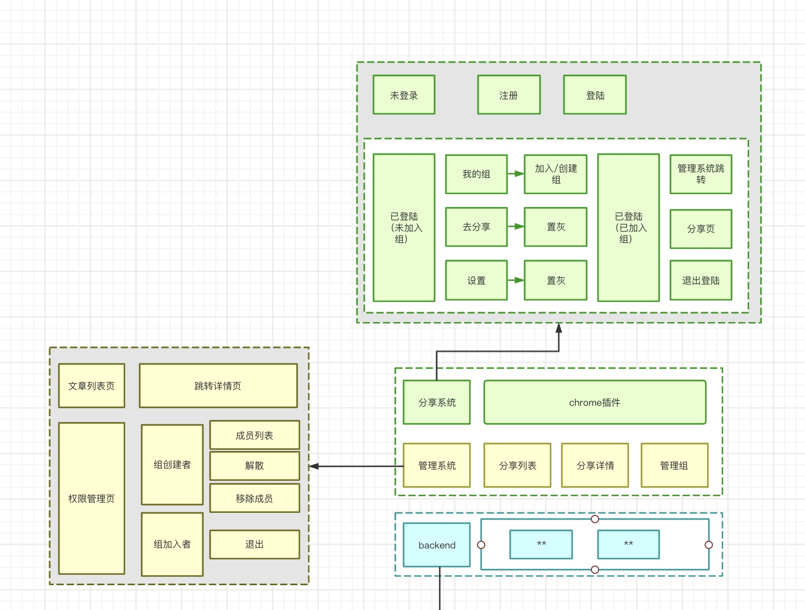
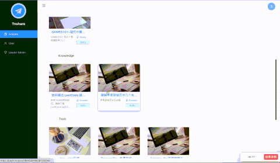

> 本拓展程序灵感来自于政采云前端团队的 [这篇文章](https://juejin.im/post/6854573219895050247)  
> 不同于其知识分享系统，本系统是用于解决不同团队对不同网站的依赖，而开发的一套书签协同管理OA系统，方便多个公用平台的管理。

不多bb，说下开发思路+实践：

## 共享系统设计思路



像笔者本身团队中就有很多网站需要存储（还有很多没有截图到...），如果有新同学入职的话，还需要将这些网站一个个分享。非常不方便，该系统可以将需要的网站进行分类存储，将自己团队的同学拉入一个组中，达到共享书签的目的。

明确了此思路，来整理一下需求：

**用户关系：管理员、普通用户。**
- 管理员权限：添加文章、查看文章、删除文章、添加分类标签、删除分类标签、移除组成员、解散组
- 普通用户权限：添加文章、查看文章、退出组

**UI形式：chrome插件、后台管理系统**
- chrome插件：注册登陆、创建/加入组、文章添加、退出登录
- 后台管理系统：查看文章、退出/解散组、添加/删除标签、移除组成员、解散组



## 项目构建

别问为什么用React+Ts，问就是React learn once, write anywhere，Ts大法真香。这里直接跑命令构建。

```bash
npx create-react-app my-app --template typescript
```

完成后我们创建一下自己需要的目录结构。

```bash
├── config  					# ts path配置
├── public  					# 存放 manifest.json 注意：该文件用于chrome拓展的信息识别
├── script						# 需要的bash脚本（后面会说）	
├── src	
│   ├── apis						# 接口
│   ├── components			# 组件
│   ├── configs					# 开发/生产环境区分
│   ├── contentScripts	# 用于 chrome
│   ├── pages						# 页面
│   ├── router					# 路由
│   ├── stores					# mbox仓库
│   ├── utils						# 工具函数
│   ├── App.tsx					
│   └── index.tsx				
├── craco.config.js		# 不想eject故通过craco修改配置项
├── tsconfig.json			# 一些ts的配置
└── package.json
```

chrome拓展打开，就相当于一个网页打开，关闭就是一个网页的关闭。所以我们的拓展需要两个功能。

1. 保存用户点击tab栏的位置（不能用户每次打开的时候都在第一页，要记录用户的点击信息）
2. 保存当前浏览器的网页信息（方便用户添加书签）


这里不再去重复普通页面的写法，没有必要。所以着重说一下作为chrome拓展程序和一般web项目不同的地方。

### chrome拓展需要识别拓展信息：故需要manifest.json文件。

```json
{
  "manifest_version": 2,

  "name": "Tnshare",
  "description": "A plugin for sharing knowledge and common tools",
  "version": "1.0",

  "permissions": ["tabs", "storage"],
  "icons": {
    "322": "icon.png"
  },
  "browser_action": {
    "default_icon": "icon.png",
    "default_popup": "index.html"
  },
  "content_scripts": [
    {
      "matches": ["<all_urls>"],
      "js": ["./contentScripts/get_data.js"],
      "run_at": "document_start"
    }
  ],
  "content_security_policy": "script-src 'self' 'sha256-hrABjXgkmzJSAYJz7Tb8+vCZlVwt6UMWGfHKxDlE+2k='; object-src 'self'"
}
```

这里主要看一下 `permissions` 、 `content_scripts` 和 `content_security_policy`

- `permissions`：我们开发所需要用到的权限。tabs为拓展与用户页面的信息交互、strong类似于localstorage用于存储用户点击信息
- `content_scripts` ：这个是chrome的规定写法，要想获取用户信息，必须创建一个js脚本，Chrome会自动将该脚本注入用户页面，以获取用户网页信息。（注意：content_scripts中js只能获取用户页面的html/css，无法获取其js内容）
- `content_security_policy`：因为webpack打包后html会有内联js，chrome插件默认禁止使用内联js，需要这里添加上js的解释形式即可（或者在craco中注入webpack全局配置取消内联注入亦可）

### srcipt中的`bash`

细心的同学可以看到，我们在`content_scripts`中指定了需要注入的js文件位置，打包的时候我们也需要保证该文件位置的一致性。由于不想eject，所以需要来写一个bash srcipt，在打包完成后将该文件夹下的内容注入到build目录下。

```bash
# 注意需要加下权限：chmod +x script/build.sh
build() {
  mkdir -p build/contentScripts
  cp -r src/contentScripts/* build/contentScripts
}
build
```

### `utils/chrome_methods.ts`下，规避开发环境没有chrome全局变量的问题

还有一个问题，由于chrome拓展中的功能使用到的是Chrome注入的全局变量。但是在本地开发的时候，没有这个变量，导致页面报错，如果我们直接注释代码又太不优雅。。。故需要将生产环境与开发环境的变量分离。

为了减少行数，代码内容把tab选项卡点击类型做了删减、减少一下重复度，一大坨代码要我我也看不下去🥕
```javascript
import React from "react"
import { stores } from "@/stores/index"
export interface IChromeMethodsProps {
  ChromeTabsQuery: (cb: Function) => void // 获取外部链接
  ChromeSetTabIdx: (key: React.Key, cb: Function) => void // 设置tab选项卡点击位置
  ChromeGetTabIdx: (cb: (tab: string) => void) => void // 获取tab选项卡点击位置
  ChromeSetToken: (token: string) => Promise<string> // 设置token
  ChromeGetToken: () => Promise<string> // 获取token
}

const dev_methods: IChromeMethodsProps = {
  ChromeTabsQuery: cb => {
    cb({
      title: "i m title",
      link: "i m link",
      description: "im description",
    })
  },
  ChromeSetToken: token => {
    return new Promise(resolve => {
      localStorage.setItem("token", token)
      stores.stateStore.handleSetToken(token)
      resolve(token)
    })
  },
  ChromeGetToken: () => {
    return new Promise(resolve => {
      const token = localStorage.getItem("token") || ""
      stores.stateStore.handleSetToken(token)
      resolve(token)
    })
  },
}

const prod_methods: IChromeMethodsProps = {
  ChromeTabsQuery(cb) {
    chrome.tabs.query({ active: true, currentWindow: true }, function (tabs) {
      chrome.tabs.sendMessage(tabs[0].id as number, { action: "GET_PAGE_DATA" }, function (response) {
        cb(response)
      })
    })
  },
  ChromeSetToken: token => {
    return new Promise(resolve => {
      chrome.storage.local.set({ token }, function () {
        stores.stateStore.handleSetToken(token)
        resolve(token)
      })
    })
  },
  ChromeGetToken: () => {
    return new Promise(resolve => {
      chrome.storage.local.get(["token"], function (res) {
        const token = res ? res.token : ""
        stores.stateStore.handleSetToken(token)
        resolve(token)
      })
    })
  },
}

const Methods = process.env.REACT_APP_ENV === "dev" ? dev_methods : prod_methods

export default {
  ...Methods,
}
```

这里有个地方要注意：`chrome.storage`是异步存储（为了提高本地io速度），`localstorage`是同步存储。所以我们这里需要用promise包一层才能保证调用方式的一致性。

### 其他

- 在ts环境中，我们直接使用chrome全局变量是会报错的，下载一个`@types/chrome`即可获取其类型构造。

### 后台页面



后台本身没有什么复杂的难点，即常规的页面开发。这里的gif就放上图片演示，作为一个完整项目的功能展示🤫。。。


## 最后

chrome插件使用文档和下载地址可在[我的github中查看](https://github.com/betterTisen/Tnshare_Doc)。

由于目前该服务在我自己的小霸王服务器上跑，故没有开源。大家可以体验一下～如果有开源需求的话，点赞这篇文章，如果多的话我会开源分享给大家，不过会停止本服务器上的线上服务。

