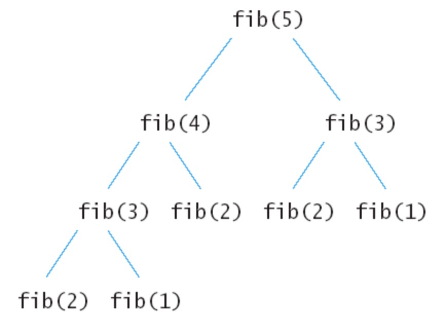
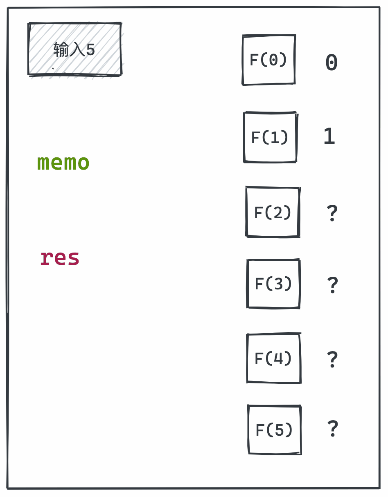

在开始做动态规划的题目前，先说一个小故事，让不知道的同学先了解何为动态规划～

```bash
A : "1+1+1+1+1+1+1+1 =？"
A : "上面等式的值是多少"
B : *计算* "8!"
A : 在上面等式的左边写上 "1+"
A : "此时等式的值为多少"
B : *quickly* "9!"
A : "你怎么这么快就知道答案了"
A : "只要在8的基础上加1就行了"
A : "所以你不用重新计算因为你记住了第一个等式的值为8!动态规划算法也可以说是 '记住求过的解来节省时间'"
```

**所以说在之前的计算结果基础上进行二次计算，可以有效的提高计算效率，这就是动态规划！**

接下来就通过一道简单的题目来学习一下动态规划。

## 【动图算法】（动态规划篇）：斐波那契数

> leetcode 509 题：斐波那契数  
> https://leetcode-cn.com/problems/fibonacci-number/submissions/

**斐波那契数**，通常用 `F(n)` 表示，形成的序列称为**斐波那契数列**。该数列由 0 和 1 开始，后面的每一项数字都是前面两项数字的和。也就是：

```javascript
F(0) = 0,   F(1) = 1
F(N) = F(N - 1) + F(N - 2), 其中 N > 1.
🌰
输入：4
输出：3
解释：F(4) = F(3) + F(2) = 2 + 1 = 3.
```

## 解答过程

### 递归法 🐢

```javascript
var fib = function (n) {
    if (n === 0) return 0
    if (n === 1) return 1
    return fib(n - 1) + fib(n - 2)
};
```

先来分析一下递归算法的执行流程，假如输入5，那么执行的递归树如下：



可以看到上面的递归树中的每一个子节点都会执行一次，很多重复的节点被执行，fib(2)被重复执行了3次。所以这一部分显然可以优化一波。

接下来尝试通过一个数组，将已经执行过的节点进行保存。

### 数组维护法 🔧

```javascript
var fib = function (n) {
    if (n <= 1) return n
    const memo = []	// 通过memo数组存储需要维护的结果
    for (let i = 0; i <= n; i++) memo.push(-1)
    // 对0，1初始化
    memo[0] = 0
    memo[1] = 1
    var handleFib = function (n) {
        if (memo[n] !== -1) return memo[n]
        else memo[n] = handleFib(n - 1) + handleFib(n - 2)
        return memo[n]
    }
    return handleFib(n)
}
```

这里通过创建一个数组对计算结果进行存储。在`handleFib()`中，判断数组中对应的结果是否存在，如果存在，则能够省去一次计算。

但是，仔细看完这段代码后你会发现，这里依然需要每次对之前结果进行访问，通过多次递归才能得到结果。在输入5后一样需要多次访问`F(2)`,但是我们理应只需要拿一次 `F(2)`，所以便有了接下来的优化。

### 动态规划 ♻️

```javascript
var fib = function (n) {
    if (n <= 1) return n
    let memo = 0
    let res = 1
    for (let i = 2; i <= n; i++) 
        [res, memo] = [res + memo, res]
    return res
}
```



从图上可以很清楚的看出，这一方法也是利用数组保存了先计算的值，为后面的调用服务。但是每个值只计算且调用了一次，而前一方法中调用了多次，同时参与循环的只有memo和res两个变量，因此该方法也是大大减少了空间复杂度。

## 最后

这里通过了这一道简单且基础的题目和大家一起初步认识了一下动态规划，在未来的几周内我们会继续学习动态规划类型的题目。
