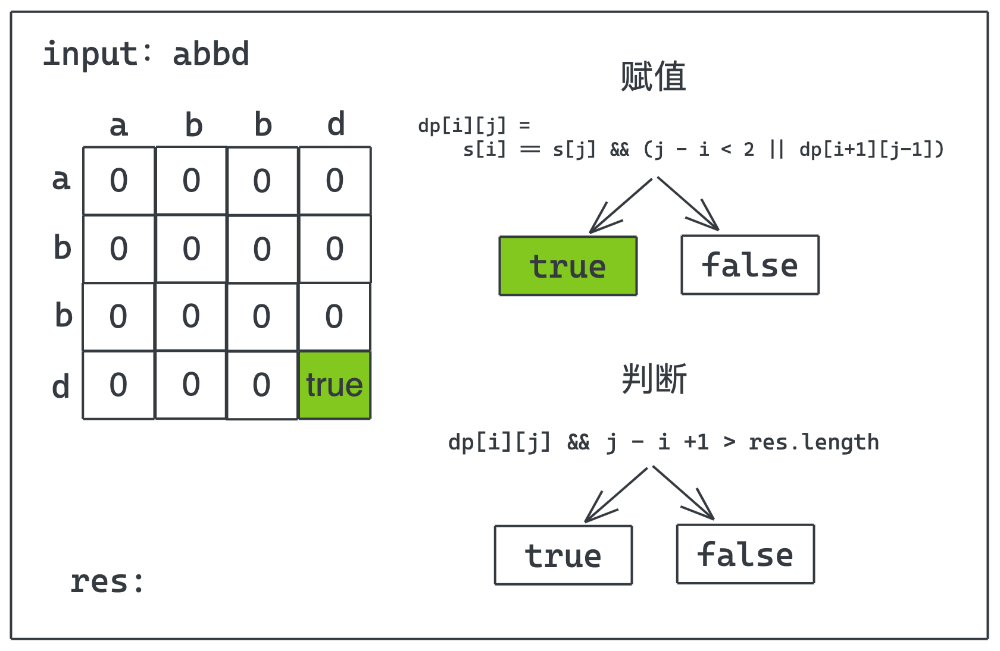

本周继续做一道动态规划类型的题目，该题是阿里一面的一道算法题。

## 【动图算法】（动态规划篇）：最长回文子串

> leetcode 5 题：最长回文子串  
> https://leetcode-cn.com/problems/longest-palindromic-substring/

给定一个字符串 `s`，找到 `s` 中最长的回文子串。你可以假设 `s` 的最大长度为 1000。

```javascript
🌰
输入: "babad"
输出: "bab"
注意: "aba" 也是一个有效答案。

🌰🌰
输入: "cbbd"
输出: "bb"
```

## 解答过程

### 动态规划-数组维护

```javascript
var longestPalindrome = function(s) {
    let n = s.length
    let res = ''
    // 初始化一个n*n的二维数组
    let dp = Array.from(new Array(n),() => new Array(n).fill(0))
    for(let i = n-1;i >= 0;i--){
        for(let j = i;j < n;j++){
            dp[i][j] = s[i] == s[j] && (j - i < 2 || dp[i+1][j-1])
            if(dp[i][j] && j - i +1 > res.length)
                res = s.substring(i,j+1)
        }
    }
    return res
};
```




### 动态规划-中心扩展

```javascript
var longestPalindrome = function(s) {
    if(!s || s.length < 2) return s
    let start = 0,end = 0;
    let n = s.length
    // 中心扩展法
    let centerExpend = (left,right) => {
        while(left >= 0 && right < n && s[left] == s[right]){
            left--
            right++
        }
        return right - left - 1
    }
    for(let i = 0;i < n;i++){
        let len1 = centerExpend(i,i)
        let len2 = centerExpend(i,i+1)
        // 两种组合取最大回文串的长度
        let maxLen = Math.max(len1,len2)
        if(maxLen > end - start){
            // 更新最大回文串的首尾字符索引
            start = i - ((maxLen - 1) >> 1)
            end = i + (maxLen >> 1)
        }
    }
    return s.substring(start,end+1)
};
```