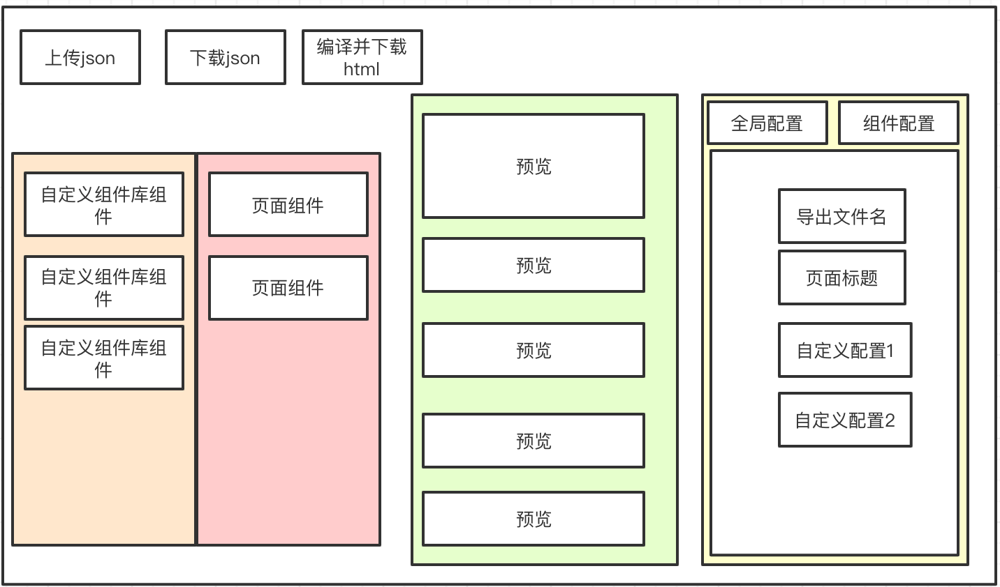

不知大家是否有着这样的需求，一个通用模板的公告类、规则类的静态页面有着长期的更新维护需求。如果每有一次新的更新公告或规则文案变动，都需要修改代码，十分的麻烦。

所以我就思考🤔，是否可以通过一个可视化的编辑器，让需求方通过零门槛的配置形式自主生成页面，从而避免重复性的体力劳动，达到解放前端同学一部分的生产力去做更有意义的事情。所以便有了本篇文章～

先看下实现后的效果：


接下来，我将带大家从需求至落地，以我的个人思路来完成一个可用的模板页面生成器✌️

## 需求分析

1. 需求方无需拥有开发基础
2. 需求方通过可视化形式查看需求页面
3. 需求方自主完成页面内容修改并生成可复用的html文件

**由于个人将该工具定义为编译工具而非运行时脚本，故根据以上需求综合分析，一个基本可用的生成器功能点整理如下**

1. 整个工具由隐式的配置文件主导，页面的生成、配置皆以配置文件为媒介
2. 配置文件的导入导出
3. 组件生成与变量提取
4. 配置文件的解析（编译为.html）

根据以上需求，该工具大致原型草图如下：



- 首先作为编译型工具，需要有必要的配置文件（json）导入导出编译按钮。
- 左侧，是一个可拖拽式组件使得需求方可以根据不同的需求对页面进行定制化配置。
- 中间则作为预览框提供实施预览，方便需求方在配置时查看效果
- 右侧则为组件的配置项，不同的组件可根据需求开放不同的配置，从而拓展了模板的定制化需求。

这里的前端框架选择React+TypeScript基础框架，当然技术框架选择不是本文重点，本文主要提供思路。接下来我会按照上述的步骤来实现这几个模块。

## 配置文件

### 配置文件结构

综合前面的需求分析，我的配置文件解决方案如下：

```json
{
  "filename": "导出html时文件名称",
  "global": {
    "title": "tab栏中的名称，即document.title",
    "css": "全局css",
    "js": "文本流加载完成后执行的js",
    "beforeLoadJs": "可选参数：文本流加载前的js",
    "externalCss": ["可选参数，里面填入字符串链接，用于引入外部的css"],
    "externalJs": ["可选参数，里面填入字符串链接，用于引入外部的js"],
    "params": {
      "globalTitle": {
        "type": "text",
        "title": "所有组件均可访问的全局变量",
        "value": "我是globalTitle"
      }
    }
  },
  // 初始页面组件
  "main": [
    {
      "id": 1, // 唯一标识，用于组件区分
      "name": "侧边栏中显示的内容",
      // 自定义局部变量
      "params": {
        "aParam": {
          "type": "text",
          "title": "右侧组件配置中显示的内容",
          "value": "可编辑的值：我是aParam"
        }
      },
      "htmlstr": "<div>我是main <%aParam%> </div>"
    }
  ],
  // 组件库可复用组件
  "component": [
    {
      "id": 2,
      "name": "与main相同",
      "params": {},
      "htmlstr": "<div><%globalTitle%>我是component</div>"
    }
  ]
}
```

配置文件的内容看注释应该比较清楚了，主要由以下几个功能点：

1. 全局配置：对应html所必须的内容
2. 组件：用于需求方根据不同的需求动态选择所需要的html段落
3. 变量：用于需求方对页面内容进行灵活配置

###  配置文件的导入与导出

**配置文件导入：**

```typescript
const handleFiles = (e: React.ChangeEvent<HTMLInputElement>) => {
  const selectedFile = e.target.files && e.target.files[0]
  if (!selectedFile) return
  const reader = new FileReader()
  reader.readAsText(selectedFile)
  reader.onload = function () {
    try {
      // 这里是将json存入store，方便各个组件编辑读取
      setJson2Store(this.result as string)
    } catch (error) {
    	console.error("配置导入失败，请检查上传文件类型是否正确!")
    }
  }
  e.target.value = ""
}
```

**配置文件导出（下载）：**

```typescript
const handleFileDownload = (content: string, type: string) => {
   const filename = `${globalSetting.filename}.${type}`
   const eleLink = document.createElement("a")
   eleLink.download = filename
   eleLink.style.display = "none"
   const blob = new Blob([content])
   eleLink.href = URL.createObjectURL(blob)
   document.body.appendChild(eleLink)
   eleLink.click()
   document.body.removeChild(eleLink)
}	

// 导出html文件
const handleHtmlDownload = () => {
  // 该方法是将全局配置与属性main中的值传入执行函数，解析成html字符串导出
  // SData2Html具体实现会在下文讲解
  const content = SData2Html(globalSetting, mainTree)
  handleFileDownload(content, "html")
}

// 导出json配置文件
const handleJsonDownload = () => {
  const content = setJson2String() // 该方法就是将store中的json取出
  handleFileDownload(content, "json")
}
```

## 组件

根据之前梳理的需求可知，组件是 **用于需求方根据不同的需求动态选择所需要的html段落并对其可变项进行编辑**

1. 组件是一个html块，可以动态的选择添加
2. 组件拥有可自定义的变量

所以，我们通过标签插值的形式使得该工具可以在编译时插入自定义的变量值。

左侧组件代码块的拖拽添加（拖拽组件选择第三方库 `react-beautiful-dnd`）：

```tsx
import { DragDropContext, Droppable, Draggable, DropResult } from "react-beautiful-dnd"


const CompComponent: React.FC = () => {
  
  // 这个函数就是在拖拽结束后添加更新Main数组中的组件块，不是重点，这里就不占用篇幅啦
  // 如果想看该方法的具体实现，可访问：https://github.com/Qionline/Qieditor/blob/master/src/components/main/comp/index.tsx#L14
  const handleDragEnd = () => {}

  return (
    <div className="comp-cmp">
      <div className="comp-title">
        <span>组件库</span>
        <span>页面模板</span>
      </div>
      <DragDropContext onDragEnd={handleDragEnd}>
        <div>
          {/* 组件库（可拖拽至页面模板） */}
          <Droppable isDropDisabled droppableId="compLib">
            {provided => (
              <div ref={provided.innerRef} {...provided.droppableProps}>
                {componentsTree.map((t, i) => (
                  <Draggable draggableId={t.id + ""} index={i} key={t.id}>
                    {(p, s) => (
                      <div ref={p.innerRef} {...p.draggableProps} {...p.dragHandleProps} key={t.id}>
                        {t.name}
                      </div>
                    )}
                  </Draggable>
                ))}
                {provided.placeholder}
              </div>
            )}
          </Droppable>
          
          {/* 页面模板（可上下拖拽调整组件位置） */}
          <Droppable droppableId="compTemp">
            {(provided, snapshot) => {
              return (
                <div ref={provided.innerRef} {...provided.droppableProps}>
                  {mainTree.map((t, i) => (
                    <Draggable draggableId={t.id + ""} index={i} key={t.id}>
                      {(p, s) => {
                        return (
                          <div
                            ref={p.innerRef}
                            {...p.draggableProps}
                            {...p.dragHandleProps}
                          >
                            {t.name}
                          </div>
                        )
                      }}
                    </Draggable>
                  ))}
                  {provided.placeholder}
                </div>
              )
            }}
          </Droppable>
        </div>
      </DragDropContext>
    </div>
  )
}
```


右侧配置项展示：

```tsx
// 变量解析组件：从store中获取变量，根据需求方的编辑动态修改store中的配置文件
const CompConfItem = ({ idx, paramKey, paramValue }) => {
  const { handleSetParamValue } = useDataStore()
  const handleChangedParams = (res: string | ParamArrayParamTypeProp[]) => {
    handleSetParamValue(idx, res, paramKey)
  }
  return (
    <div>
      <Input value={paramValue.value} onChange={e => handleChangedParams(e.target.value)} />
    </div>
  )
}

// 全局配置
const ConfGlobal: React.FC = () => (
  <div>
    <span>导出文件名</span>
    <div>
    	<Input value={globalSetting.filename} onChange={handleChangeFilename} />
    </div>

    <span>页面标题</span>
    <div>
      <Input value={globalSetting.global.title} onChange={handleChangeTitle} />
    </div>
    
    /* 这里的 globalSetting.global.params 是从store中取出的全局变量 */
    {Object.keys(globalSetting.global.params).map((v, i) => {
      const el = globalSetting.global.params[v]
      return (
      <div key={i}>
        <span>{el.title}</span>
        <CompConfItem idx={-1} paramKey={v} paramValue={{ ...el }} />
      </div>
      )
    })}
  </div>
)

// 组件配置
const ConfComponent: React.FC = () => (
  <div>
    <span className="title">
      {mainTree[componetSelectState].name}({componetSelectState})
    </span>
    <div>
      /* 这里的 mainTre 是从store中取出的组件树，其中componetSelectState 为当前选中的组件 */
      {Object.keys(mainTree[componetSelectState].params).length === 0 ? (
        <div>该组件无配置项</div>
        ) : (
        Object.keys(mainTree[componetSelectState].params).map((v, i) => {
          const el = mainTree[componetSelectState].params[v]
          return (
            <div key={i}>
              <span>{el.title}</span>
              <CompConfItem idx={componetSelectState} paramKey={v} paramValue={{ ...el }} />
            </div>
          )
        })
      )}
    </div>
  </div>
)
```


该段代码均为展示性代码，实际上就是通过可视化的形式对配置文件进行修改

## 配置文件解析与渲染

该工具的整个流程皆始于配置文件，配置文件在工具中可视化的显式给需求方进行配置，配置完成后讲更新的配置文件进行解析编译

上文已完成的配置文件的页面展示，接下来咱们就来完成解析编译的部分。

### 【解析】组件代码块编译

类型定义：
```typescript
// 变量类型
export interface ParamTextType {
  type: "text"
  title: string
  value: string
}
export interface ParamArrayType {
  type: "array"
  title: string
  template: string
  item: ParamArrayParamTypeProp
  value: ParamArrayParamTypeProp[]
}
export type ParamArrayTypeProp = ParamTextType 
export type ParamTypeProp = ParamTextType | ParamArrayType

export interface ParamArrayParamTypeProp {
  [propName: string]: ParamArrayTypeProp
}
export interface componentsTreePramasProp {
  [propName: string]: ParamTypeProp
}
// 全局配置类型定义
export interface globalSettingProp {
  filename: string
  global: {
    title: string
    direction: "ltr" | "rtl"
    bodyColor: string
    css: string
    js: string
    beforeLoadJs?: string
    externalCss?: string[]
    externalJs?: string[]
    params: componentsTreePramasProp
  }
}
// 组件项类型定义
export interface componentsTreeProp {
  id: number
  name: string
  params: componentsTreePramasProp
  htmlstr: string
}
```

编译实现：
```typescript
// 内部关键字、使用者禁止使用关键字中出现的值作为变量，此关键字用于获取组件块的dom以方便js操作
const KEY_WORD = {
  QID: "<%Qid%>",
  QIDDOM: "<%QidDom%>",
}

// 错误处理
const handleArrayTypeError = function () {
  throw new Error("配置文件错误：禁止array类型参数中使用array类型参数作为子变量!")
}

// 数组变量类型解析
const handleArrayTmp = function (template: string, vArray: ParamArrayParamTypeProp[],  comonParams: componentsTreePramasProp) {
  let tmp: string[] = []
  const reg = /<%\w*%>+/g
  const paramsArr = template.match(reg)
  if (!paramsArr) {
    vArray.forEach(() => {
      tmp.push(template)
    })
    return tmp.join("")
  }

  vArray.forEach(el => {
    let vTemp = template
    for (const value of paramsArr) {
      const param = value.split("%")[1]
      if (el[param]) vTemp = vTemp.replace(new RegExp(value), el[param].value)
      else if (comonParams[param]) {
        if (comonParams[param].type === "array") handleArrayTypeError()
        vTemp = vTemp.replace(new RegExp(value), comonParams[param].value as string)
      }
    }
    tmp.push(vTemp)
  })

  return tmp.join("")
}

// 编译：字符串替换（替换<% %>中的内容）
const TmpReplace = function (id: number, tmp: string, compParams: componentsTreePramasProp, globalParams: componentsTreePramasProp): string {
  // 在根div中注入qid <div qid=`q${id}`></div>
  // qid 可用于js中获取组件块的dom，当然这可根据需求选择是否需要
  const qidReg = /<div/
  tmp = tmp.replace(qidReg, `<div qid="q${id}"`)

  // 关键字替换
  tmp = tmp.replace(new RegExp(KEY_WORD.QID), `q${id}`)
  tmp = tmp.replace(new RegExp(KEY_WORD.QIDDOM), `document.querySelectorAll('[qid="q${id}"]')[0]`)

  // 匹配自定义变量替换
  const reg = /<%\w*%>+/g
  const paramsArr = tmp.match(reg)
  if (!paramsArr) return tmp
  
  // 按照层级替换变量值
  for (const value of paramsArr) {
    const param = value.split("%")[1]
    if (compParams[param]) {
      tmp = tmp.replace(
        new RegExp(value),
        compParams[param].type === "array"
          ? handleArrayTmp((compParams[param] as ParamArrayType).template, (compParams[param] as ParamArrayType).value, compParams)
          : (compParams[param].value as string)
      )
    } else if (globalParams[param]) {
      tmp = tmp.replace(
        new RegExp(value),
        globalParams[param].type === "array"
          ? handleArrayTmp((globalParams[param] as ParamArrayType).template, (globalParams[param] as ParamArrayType).value, globalParams)
          : (globalParams[param].value as string)
      )
    }
  }

  return tmp
}
```

### 【渲染】文件预览与生成

预览和生成的逻辑相似，前者是将配置文件转化为html字符串插入iframe进行预览，后者则是讲生成的html字符串转化为文件并下载。下面通过代码展示配置文件转化为html部分：

```typescript
interface SData2HtmlFuncProp {
  (globalSetting: globalSettingProp, mainTree: componentsTreeProp[])
}

 const SData2Html: SData2HtmlFuncProp = (globalSetting, mainTree) => {
  let main = ""
  // 依次按照Main中的组件进行解析为html字符串
  mainTree.forEach(el => {
    // TmpReplace见 上文组件代码块编译 部分
    const res = TmpReplace(el.id, el.htmlstr, el.params, globalSetting.global.params)
    main += res
  })

  const beforeLoadJs = globalSetting.global?.beforeLoadJs ? `<script>${globalSetting.global.beforeLoadJs}</script>` : ""
  const externalCss = globalSetting.global?.externalCss ? [...globalSetting.global.externalCss] : []
  const externalJs = globalSetting.global?.externalJs ? [...globalSetting.global.externalJs] : []

  return `
  <!DOCTYPE html>
  <html>
    <head>
      <meta charset="UTF-8" />
      <meta name="viewport" content="width=device-width, initial-scale=1.0, maximum-scale=1.0, user-scalable=no, viewport-fit=cover" />
      <meta http-equiv="X-UA-Compatible" content="ie=edge" />
      <title>${globalSetting.global.title}</title>
      ${externalCss.map(v => `<link rel="stylesheet" href="${v}" />`).join("")}
      ${beforeLoadJs}
    </head>
    <style>body{background-color:${globalSetting.global.bodyColor};direction:${globalSetting.global.direction}}</style>
    ${globalSetting.global.css ? `<style>${globalSetting.global.css}</style>` : ``}
    <body>
      <div id="qiapp">${main}</div>
    </body>
    ${externalJs.map(v => `<script src="${v}"></script>`).join("")}
    ${globalSetting.global.js ? `<script>${globalSetting.global.js}</script>` : ``}
    </html>
  `
}
```

字符串生成后，只需要动态添加更新ifame即可完成预览啦。

以上，整个编辑器实现的核心思路就都已完成 🎉

## 完整代码

完整代码我已实现并上传至该 [仓库](https://github.com/Qionline/Qieditor)，

如果大家也有类似的需求需要应用于生产环境， 或者具体实现上需要有所参考皆可访问此仓库共同交流学习～

同时，由于本身json文件的编写较为繁琐、调试性较差。我写了一个简易的开发工具，方便大家以近似纯原生的开发模式来开发&调试模板文件，如有需要可[ 点击此处 ](https://github.com/Qionline/Qieditor-template)查看。